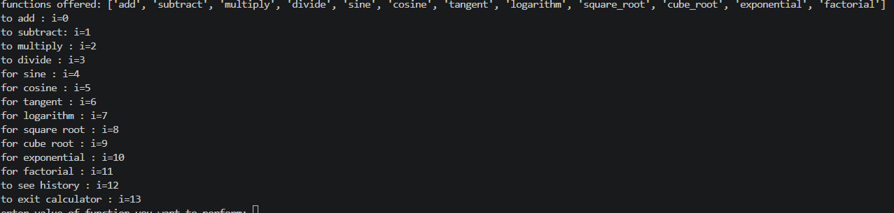
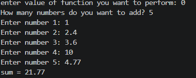
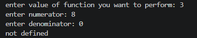
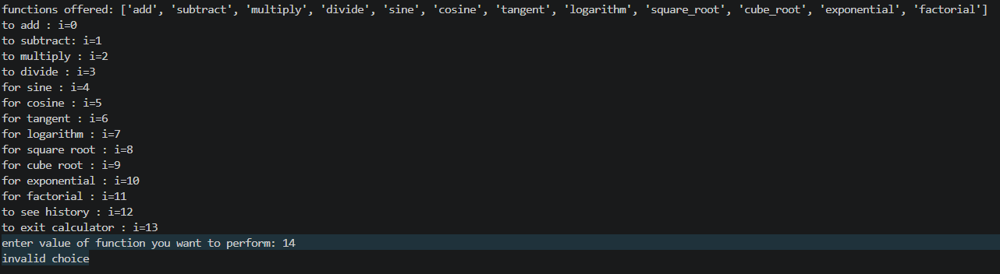
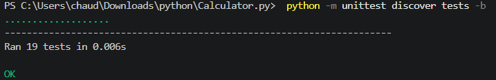

# Python Command-Line Scientific Calculator

## Overview
This project is an interactive, menu-driven calculator written in Python. It lets the user perform basic arithmetic and scientific calculations in a continuous loop until they choose to exit. The code is divided into separate modules, and the main file imports and uses them.

## Features
- **Basic arithmetic:** addition (multiple numbers), subtraction, multiplication (multiple numbers) and division (quotient, remainder and exact division).
- **Scientific operations:** sine, cosine, tangent (degrees), logarithms (base 10, natural, base 2), square root and cube root.
- **Extras:** exponential (power) and factorial.
- **Dynamic input:** the user chooses how many numbers to add or multiply.
- **Input validation:** letters or invalid values are rejected and the user is asked again.
- **Error handling:** division by zero, log of non-positive numbers, square root of negative numbers, tan(90) and negative factorial show a message instead of crashing.
- **History:** view the calculations done in the current session.
- **Continuous execution:** runs in a `while` loop until the user exits.

## Technologies & Tools Used
- **Language:** Python 3.x
- **Libraries:** `numpy` (sin, cos, tan, log, sqrt, cbrt), `unittest` (testing)
- **Version control:** Git and GitHub

## Project Structure
```
Calculator_Project/
├── Calculator_project.py   # main program (menu and loop)
├── Arithmetic.py           # add, subtract, multiply, divide
├── scientific.py           # sine, cosine, tangent, logarithm, square root, cube root
├── extras.py               # exponential, factorial
├── validation.py           # checks user input
├── tests/
│   └── test_calculator.py  # unit tests
├── docs/                   # screenshots
├── requirements.txt
├── statement.md
└── README.md
```

## Steps to Install & Run the Project
1. **Install Python:** make sure Python 3.x is installed.
2. **Install NumPy:** run `pip install numpy` (or `pip install -r requirements.txt`).
3. **Run the program:** open the project folder in a terminal and run `python Calculator_project.py`

## Menu
| Choice | Operation | Choice | Operation |
|---|---|---|---|
| 0 | add | 7 | logarithm |
| 1 | subtract | 8 | square root |
| 2 | multiply | 9 | cube root |
| 3 | divide | 10 | exponential |
| 4 | sine | 11 | factorial |
| 5 | cosine | 12 | view history |
| 6 | tangent | 13 | exit |

## Instructions for Testing
**Automated tests:** from the project folder run
```
python -m unittest discover tests -b
```
All 19 tests should pass.

**Manual tests:**
1. Run the program and check that the menu is displayed.
2. Enter `0`, add 3 numbers and check the sum.
3. Test edge cases:
   - Division (`3`) with denominator `0` prints "not defined".
   - Logarithm (`7`) with a negative number prints an error message.
   - Square root (`8`) with `-1` prints an error message.
   - Tangent (`6`) with `90` prints "not defined".
   - Factorial (`11`) with `-3` prints an error message.
   - Typing letters at any prompt asks for the value again.
   - Entering `99` at the menu prints "invalid choice".
4. Enter `12` to see the history and `13` to exit.

## Screenshots
Add your screenshots to the `docs/` folder and link them here:

**Menu of calculator functions**



**Add function with output**



**Error handling (denominator = 0)**



**Invalid choice handling**



**Tests passing**



## Future Enhancements
Memory functions, radian/degree option, saving history to a file, and a graphical interface.
